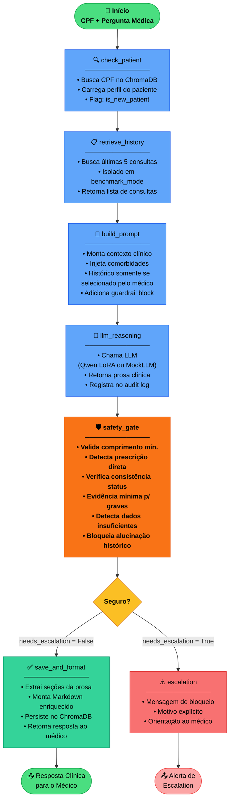
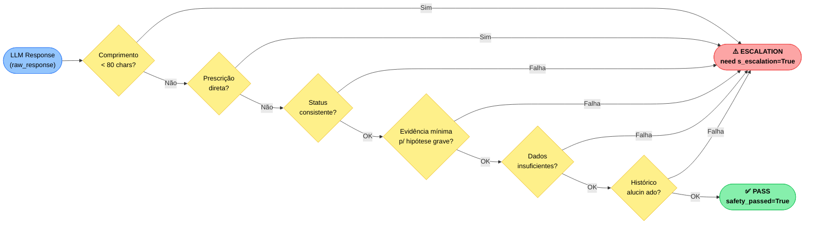
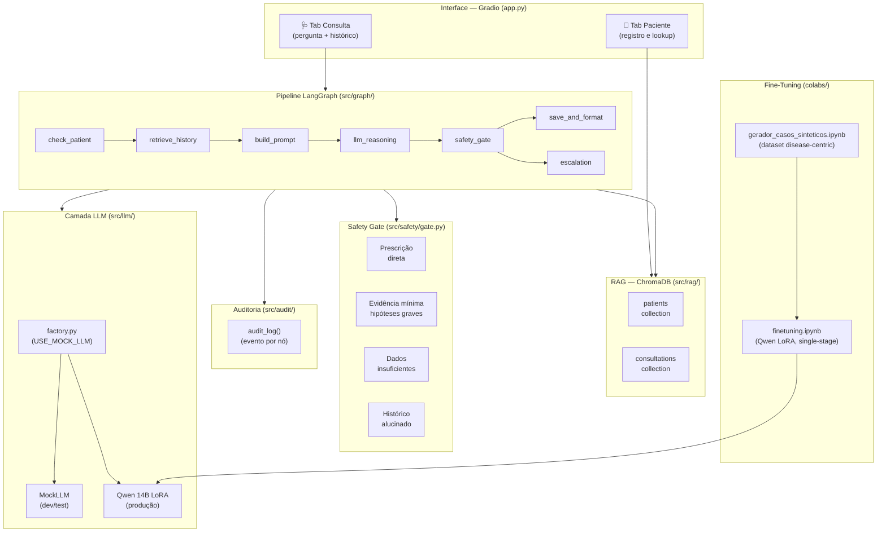
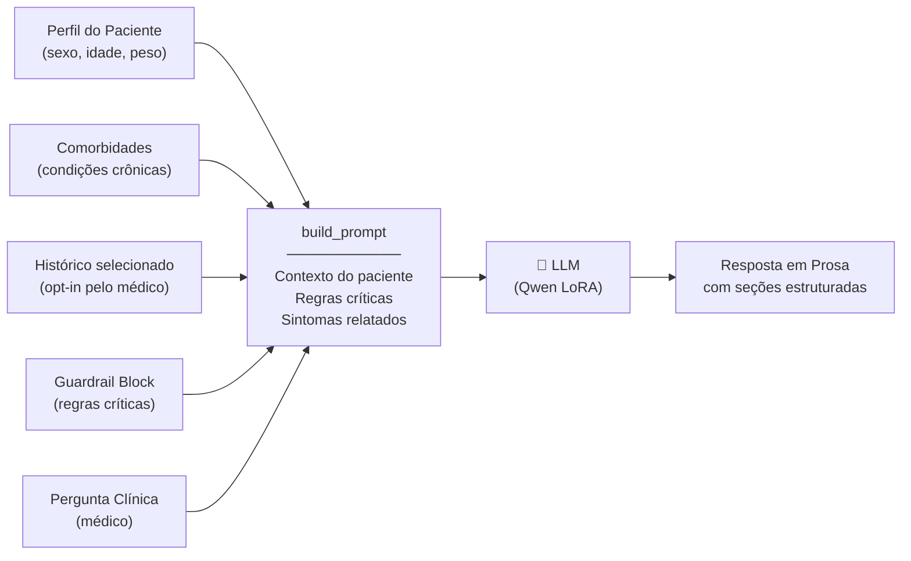

# Diagrama do Pipeline — LangGraph

## Fluxo Principal

---

## Safety Gate — Camadas de Validação

---

## Arquitetura Completa do Sistema

---

## Fluxo de Dados — Construção do Prompt

---

*Diagramas gerados em: 2026-03-22*  
*Renderização: GitHub Markdown, Notion (com plugin Mermaid), ou [mermaid.live](https://mermaid.live)*
